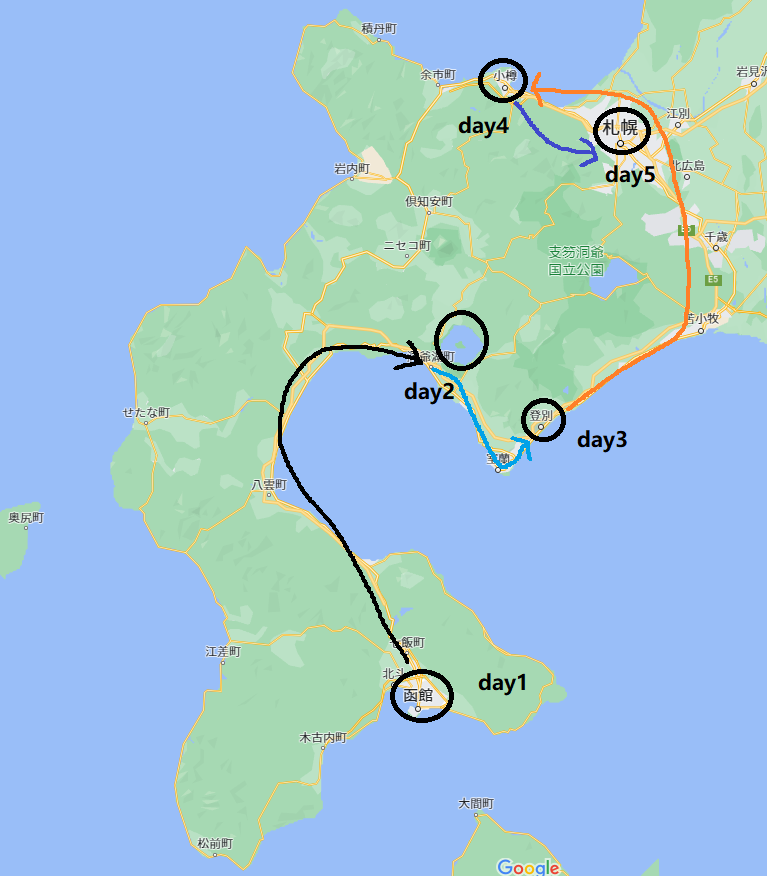
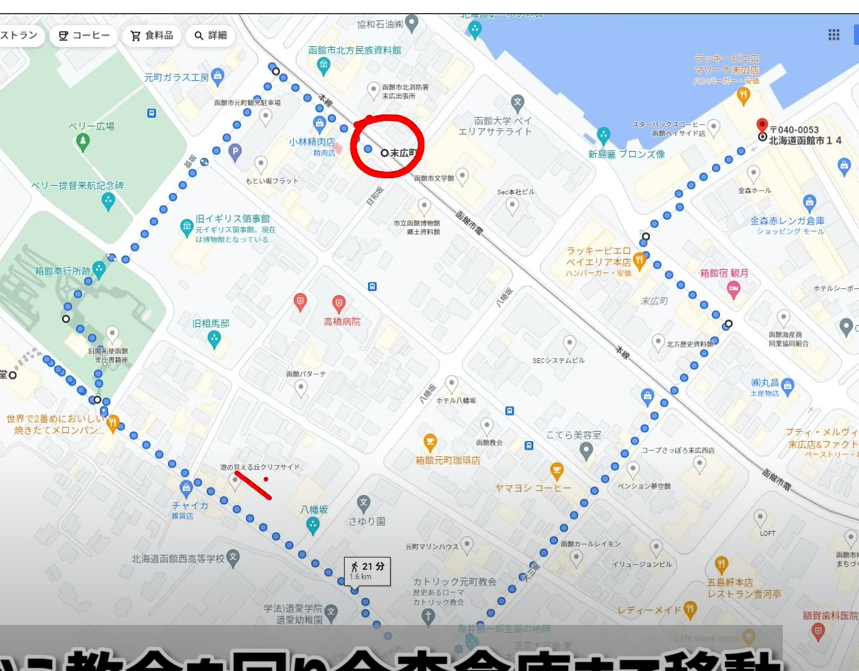
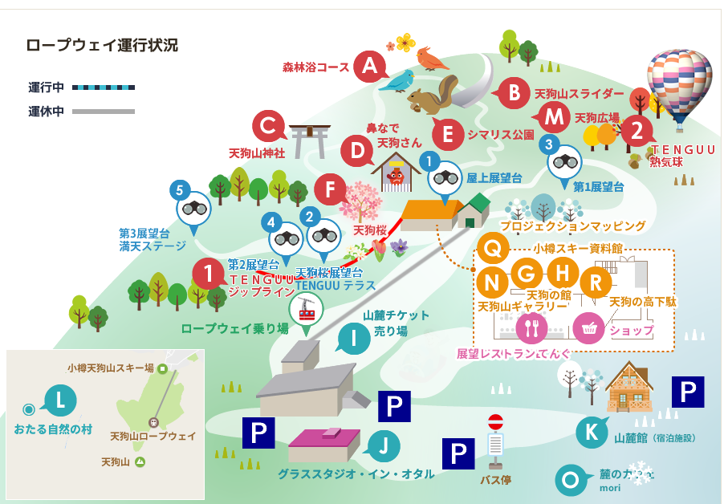
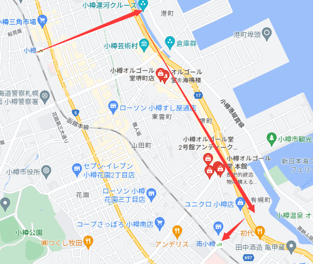

```**注意：北海道日落时间为16:00**```

## 总览


## 12.29 day1-函館
**行程**
* 上野集合，坐新干线从上野到新函館北斗（9:34 - 13:33）（车费：23230）（午饭车上解决）
* 新函館北斗坐电车到末広町，大概半小时左右到（14:30）（如果行李多的话可以路过酒店先去把行李给放了）
* 按下图路线逛元町エリア看西式建筑，八幡坂，大概1个小时左右 （15:30）。

* 出发去函館山，刚好可以看到日落前，日落，日落后的景色（日落后30分钟能看到夜景），缆车大概10分钟一趟，21点是最终缆车。
  > 日没・夜景になる時間から１~2時間は山頂展望台が大変混み合うことが予想されます。
* 下山后可以坐车或者走路（20分钟）到函館駅旁边的屋台村，这里有很多店，慢慢吃顿饭。
* 回酒店。

**酒店**
* 函館市内找，TBD

## 12.30 day2-洞爺湖
**行程**
* 吃早饭
* 坐特急从函館駅到JR洞爺駅（10:05-11:58）（车费：5920）（如果坐普通车最快也要16:14到洞爺站了，所以只能坐特急）
* bus：JR洞爺駅前-洞爺湖温泉（12:12-12:32）（可以先把行李放酒店）
  > bus单程30分钟，340日元，大概45分钟一趟，从8点到20点半。[这里是bus时刻表](https://www.donanbus.co.jp/map/toyako_toyakoonsen/)

选择1：
* 在洞爺湖温泉吃午饭。
* 洞爺湖温泉的湖畔随便散步，洞爺湖八景就在这湖畔，可以租自行车。
* 洞爺湖中島巡り遊覧船，因为是湖没有什么浪基本不会摇所以不用担心晕船,也可以选择坐モーターボート，就是那种很快的小船。
  >  60分钟一趟，大概坐45分钟，1,500円。[遊覧船官网和时刻表](http://www.toyakokisen.com/price/)
* 在洞爺湖温泉吃晚饭。
* にぎわい広場看イルミネーション，要17:00～22:00去。
* 回酒店

选择2：
* 租貸切タクシー逛一圈model course，可以看洞爺湖附近很多有名的景点，一辆车大概2-3小时10000-20000吧。
  比如：洞爺湖温泉(洞爺駅)～洞爺西湖畔～昭和新山・有珠山～サイロ展望台～洞爺水の駅～洞爺湖温泉(洞爺駅)。[点我看详情](https://www.taxisite.com/sig/detail/2652.aspx)
* 逛完后去洞爺湖中島巡り遊覧船。
* 在洞爺湖温泉吃晚饭。
* にぎわい広場看イルミネーション，要17:00～22:00去。
* 回酒店

**酒店**
* 洞爺湖温泉找，TBD

## 12.31 day3-登别
**行程**
* bus：洞爺湖温泉-洞爺駅前（10:05-10:26） 

选择1：普通列车
* 由于最早11:26发车，所以有一个小时左右的时间在洞爺駅附近逛逛。
* 洞爺駅 - 登別駅（11:26 - 13:42）（车费：1290）（在東室蘭停75分钟，可以在東室蘭这个城市随便逛逛，顺便吃个午饭）
* bus：登别駅前- 登別温泉（14:20- 14:45）
  >  大概半小时一辆，一趟25分钟左右，回来的班次到21点。[点我看时刻表](https://www.donanbus.co.jp/map/noboribetsu_ashiyu/)
* 在登別温泉看[地獄谷](https://mitchie-m.com/blog/trip/noboribetsu-onsen-jigokudani/)，[のぼりべつクマ牧場(看熊的)](https://bearpark.jp/)。
  >  关于のぼりべつクマ牧場，入园劵是2,650円，包含缆车来回的钱。缆车单程7分钟左右，要看60分钟左右。【営業時間】9:30 ～ 16:30 (最終入園15:50)[入園情报](https://bearpark.jp/information/)
* bus回登別市内吃晚饭
* 登别市内逛逛回酒店

选择2：特急列车
* 洞爺駅 - 登別駅（10:54 - 11:33）（车费：2440）
* 和上面形成一样，但是因为多了点时间，可以多去一个[登別伊達時代村](https://edo-trip.jp/show/program/)
  >  9点到16点营业，15点之前要进去，入园劵是2900円。

**酒店**
* 登别市内找，TBD

## 1.1 day4-小樽
**行程**
* 登別駅 - 小樽駅（9:36-11:47）（车费：4340）（札幌到小樽的那段要坐右边，右边海景很好看）
* 吃个饭，不饿的话就天狗山下来后吃。
* bus：小樽駅前 - 天狗山
  >  大概30分钟一趟，一趟20分钟。[点我看时刻表](https://www.navitime.co.jp/bus/diagram/timelist?date=2023-01-01&hour=4&departure=00057579&arrival=00057761&line=00016867&from=up.search.area)
* 缆车上天狗山
  >  运行时间到17点为止，大概12分钟一趟，一趟4分钟，缆车费是来回1400。[点我看详情](https://tenguyama.ckk.chuo-bus.co.jp/guide/#Ropeway)
* 天狗山上绕一圈，下图是山上的地图。
  
* 回到小樽市内闲逛，从小樽站走到南小樽站，路线看下面，途中经过船見坂，オルゴール館，小樽運河等等
  
* 小樽市内吃晚饭
* 回酒店

**酒店**
* 小樽或者札幌市内找，TBD

## 1.2 day5-札幌
**行程**
* 札幌市内玩玩，买买，吃吃坐飞机回东京，玩的地点TBD。
